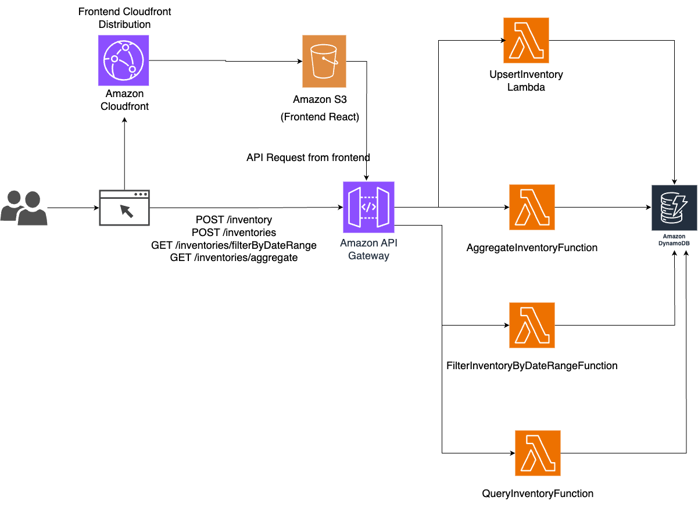

****
# Inventory Management System
This is a serverless inventory management system created with AWS services. You can access the system [here](https://d2ngzfpqeh77qd.cloudfront.net/.)

## Environment setup

### Requirements
You need these on your computer before you can proceed with the setup.
* pip 
* git 
* Python >= 3.8 
* aws-cdk

### To Run locally
1. Clone this repository
```
$ git clone https://github.com/SarahTeoh/inventory-management-system.git 
```

2. Ensure CDK is installed
```
$ npm install -g aws-cdk
```

3. Create a python virtual environment:

```
$ python3 -m venv .venv
```

4. Activate the virtual environmetn
On MacOS or Linux
```
$ source .venv/bin/activate
```

On Windows

```
% .venv\Scripts\activate.bat
```

5. Install required dependencies
```
$ pip install -r requirements.txt
```

6. Synthesize (cdk synth) or deploy (cdk deploy) the template
```
$ cdk synth
$ cdk deploy
```

### To Test locally
```
$ python3 -m pytest 
```

### API endpoints
Base path: https://fs2hjjfa0d.execute-api.ap-southeast-1.amazonaws.com 
<table>
<thead>
<tr>
<th></th>
<th>Http Method</th>
<th>Integrated Lambda</th>
<th>Function</th>
<th>Example Parameters</th>
</tr>
</thead>
<tbody><tr>
<td><a href="https://fs2hjjfa0d.execute-api.ap-southeast-1.amazonaws.com/inventory"> /inventory </a></td>
<td>POST</td>
<td>upsertInventoryFunction</td>
<td>Upsert item. If item with same name and same category doesn&#39;t exist, new item is created. If an item with same name and category exists, the item will be updated with new price.</td>
<td>

```json
{
  "name": "Thing",
  "category": "Stationary",
  "price": 7.6
}
```

</td>
</tr>
<tr>
<td><a href="https://fs2hjjfa0d.execute-api.ap-southeast-1.amazonaws.com/inventories/filterByDateRange"> /inventories/filterByDateRange </a></td>
<td>GET</td>
<td>filterInventoryByDateRangeFunction</td>
<td>Filter items that have <code>last_updated_dt</code> within the date range and return total price of the items.</td>
<td>

```json
{
  "dt_from": "2022-01-01 10:00:00",
  "dt_to": "2022-01-25 10:00:00"
}
```

</td>
</tr>
<tr>
<td><a href="https://fs2hjjfa0d.execute-api.ap-southeast-1.amazonaws.com/inventories/aggregate"> /inventories/aggregate </a></td>
<td>GET</td>
<td>aggregateInventoryFunction</td>
<td>Filter items by category and total price. If <code>all</code> is passed, it will return all category.</td>
<td>

```json
{
  "category": "all"
}
```

</td>
</tr>
<tr>
<td><a href="https://fs2hjjfa0d.execute-api.ap-southeast-1.amazonaws.com/inventories"> /inventories </a></td>
<td>POST</td>
<td>queryInventoryFunction</td>
<td>Query items with filters, pagination and sorting options.</td>
<td>

```json
{
  "filters":
    {
      "name": "note"
      "category": "Stationary",
      "price_range": [1,10]
    },
  "pagination":
    {
      "page": 1,
      "limit": 10
    },
  "sort":
    {
      "field": "price",
      "order": "asc"
    }
}
```

</td>
</tr>
</tbody></table>


[](https://app.getpostman.com/run-collection/9636334-96c9786e-d1ba-4984-aa57-e950c20680b9?action=collection%2Ffork&source=rip_markdown&collection-url=entityId%3D9636334-96c9786e-d1ba-4984-aa57-e950c20680b9%26entityType%3Dcollection%26workspaceId%3Ded06f64f-fc04-427f-977f-4f3abacdbff7)


## Architecture
the cloud infrastructure resources are defined and provisioned using AWS Cloud Development Kit (CDK). This is the architecture used.

AWS Services used and their functions are listed below.
| Amazon Service | Function                                                                                 |
|----------------|------------------------------------------------------------------------------------------|
| API Gateway    | Receive requests and return response                                                     |
| S3             | Host frontend created with React                                                         |
| CloudFront     | Fast content delivery network, acts as distributed cache of frontend hosted in S3 bucket |
| Lambda         | Process requests                                                                         |
| DynamoDB       | Store data                                                                               |

## Data model
The DynamoDB data model looks like this. The detailed diagram can be accessed under [`docs` directory here](docs).
|                         | Type                   | Partition Key | Sort Key        |
|-------------------------|------------------------|---------------|-----------------|
| Inventory Table         | Base Table             | name          | category        |
| CategoryPriceIndex      | Global Secondary Index | category      | price           |
| ItemsLastUpdatedDtIndex | Global Secondary Index | static_pk     | last_updated_dt |
| ItemsPriceIndex         | Global Secondary Index | static_pk     | price           |


Please note that the static_pk value is a constant "PRODUCT". This is because DynamoDB is schemaless,
so in order to retrieve a record we need to provide the partition key(exact match).
We will have to scan the dynamodb table if we don't have a partition key.
This might consume a big amount of Read Capacity Unit(RCU).
So I made up a constant value here as partition key to save cost. 
This is to save cost, but if the amount of data is big, we shall plan to use other design methods like partition sharding instead. 